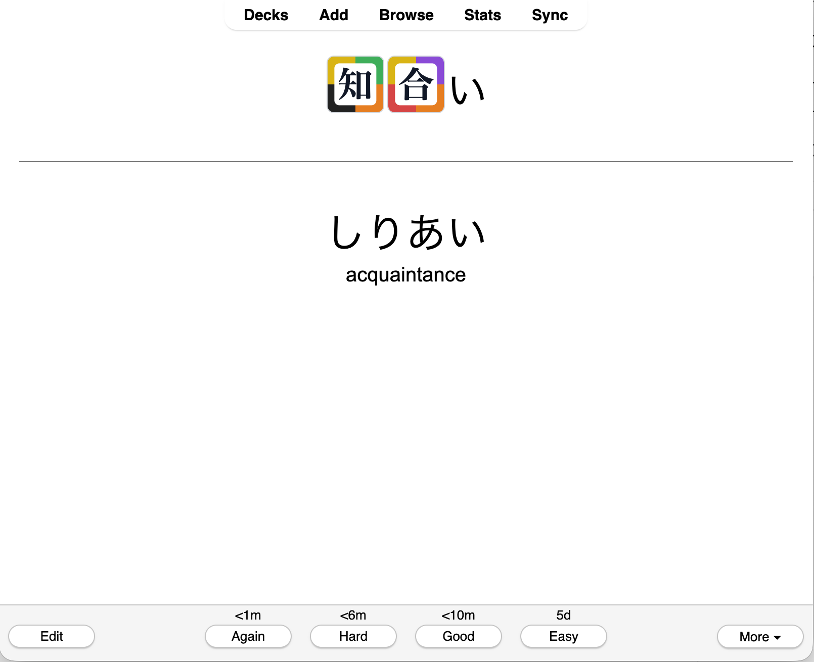

# Kanji Grid Anki Converter

Create Anki decks where mapped kanji are rendered as Kanji Grid four-corner tiles. The MVP path is a native Anki add-on: it duplicates notes into a new deck inside Anki, transforms every note field, and leaves the original deck untouched.

The bundled mapping covers the same canonical set as the Kanji Grid memorizer app: all Joyo kanji plus the Jinmeiyo supplemental set, 2,999 entries total.



## Anki Add-on MVP

Build the add-on package:

```bash
python3 scripts/package_addon.py
```

Install `dist/kanji_grid_anki_converter.ankiaddon` in Anki with `Tools > Add-ons > Install from file`, then restart Anki.

In Anki, run:

```text
Tools > Create Kanji Grid Deck...
```

Choose a source deck and confirm the output deck name. The add-on creates fresh duplicate notes/cards in the output deck and transforms mapped kanji in every note field. It stores nothing outside Anki's own collection.

Use `Tools > Sync Kanji Grid Scheduling` to update existing Kanji Grid decks so their cards match the review status and scheduling of the corresponding cards in the original decks.

## APKG CLI

The repo also includes a batch converter for `.apkg` files.

Install the CLI from the repo root:

```bash
python3 -m pip install -e .
```

Then convert a deck:

```bash
kanji-grid-anki input.apkg
```

By default, the output is written beside the input as:

```text
input.kanji-grid.apkg
```

Restrict conversion to specific note fields by passing `--field` more than once:

```bash
kanji-grid-anki input.apkg \
  --field Expression \
  --field Sentence \
  --output output.apkg
```

List fields in a deck without converting it:

```bash
kanji-grid-anki input.apkg --list-fields
```

For source-checkout use without installing:

```bash
PYTHONPATH=src python3 -m kanji_grid_anki_converter input.apkg
```

## Furigana

The converter leaves furigana readings intact. For HTML ruby markup, kanji inside `<rt>` and `<rp>` tags are skipped. For common Anki bracket-style furigana such as `漢字[かんじ]`, the kanji are replaced and the bracketed reading remains unchanged.

## Development

Run tests with:

```bash
PYTHONPATH=src python3 -m unittest discover -s tests
```
